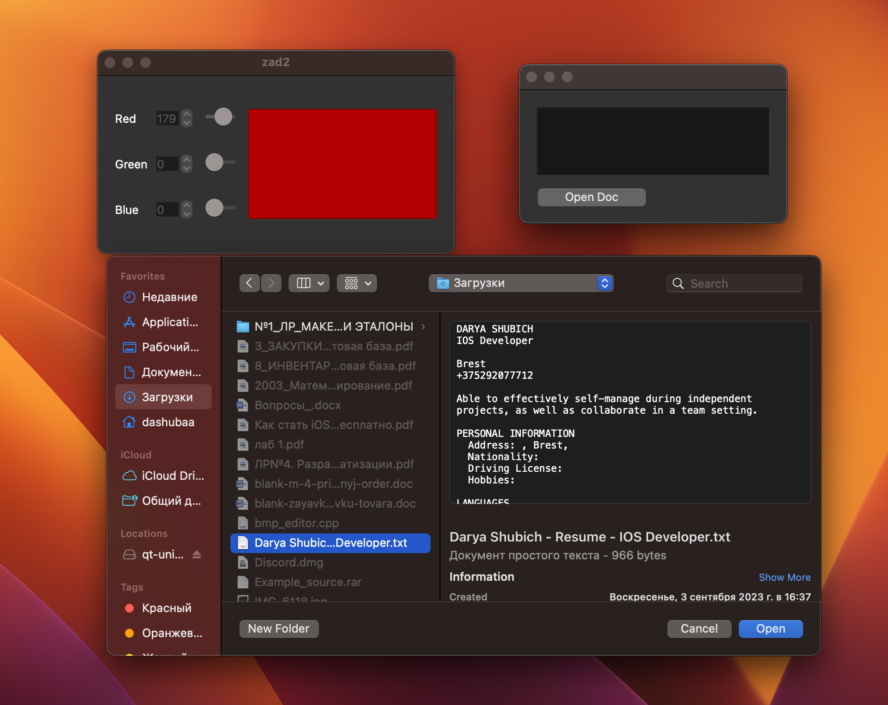
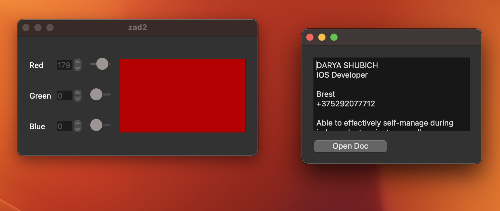

# Отчет по лабораторной работе №1

## Использование библиотеки элементов графического интерфейса Qt

`Шубич Дарья Константиновна (ПО-9)`

## Цель лабораторной работы

Научиться использовать библиотеку элементов графического интерфейса Qt.

## Задание *(4 балла)*

*   пользуясь примером в каталоге lab08/02, создайте приложение с графическим интерфейсом, аналогичным представленному ---сверху---

*   используйте классы QLabel, QSpinBox, QSlider, QPlainTextEdit.

## Знакомство с элементами интерфейса: добавим функциональность. *(3 балла)*

*   Добавим функциональность созданному на предыдущем этапе приложению:

    *   спин-боксы и слайдеры будут перемещаться синхронизировано в диапазоне значений от 0 до 255.

    *   Цвет фона QPlainTextEdit будет меняться соответственно

*   Выполнение:

    *   Выставляем диапазон допустимых значений для QSpinBox и QSlider при помощи методов setMinimum() и setMaximum()

    *   запрещаем ввод в текстовое поле: setEnabled(false)

    *   Реализуем метод setColor() и слоты setRed(int), setGreen(int), setBlue(int)

    *   к слотам подключаем сигналы QSlider::sliderMoved() и QSpinBox::valueChanged()

    *   в реализации слотов синхронизируем значения слайдера и спин-бокса и вызываем setColor()

*   Для изменения цвета фона текстового поля воспользуемся таблицами стилей для описания стиля элементов.

    *   таблицы стилей используют синтаксис CSS

    *   будем задавать цвет в виде строки типа #rrggbb

    *   таким образом, надо задать QPlainTextEdit следующий стиль:

    *   QPlainTextEdit { background: #rrggbb; }

    *   задаём стиль при помощи метода setStyleSheet() (таблица стиля передаётся в виде строки).
        
    ## Диалоги *(3 балла)*

Библиотека графических элементов Qt предлагает набор из нескольких полнофункциональных диалоговых окон, позволяющих выполнять некоторые стандартные операции. Среди них такие, как выбор файла в файловой системе, выбор шрифта, выбор цвета, диалог печати и некоторые другие. Мы рассмотрим в настоящей работе пример использования диалога выбора файла - QFileDialog.

**Создаём простейший обозреватель текстовых файлов.**

*   Создайте новый виджет и поместите на него элемент QTextEdit.

*   Добавьте кнопку QPushButton и подключите её сигнал clicked() к слоту openFile()

*   Реализуйте в слоте выбор имени файла пользователем: QFileDialog::getOpenFileName()

*   Откройте QFile в соответствии с выбранным названием

*   Прочитайте его содержимое и поместите в виде текста в элемент QTextEdit
    
    

## Код программы
```c++
#include <QApplication>
#include <QWidget>
#include <QPushButton>
#include <QLabel>
#include <QSpinBox>
#include <QSlider>
#include <QPlainTextEdit>
#include <QGridLayout>
#include <QObject>
#include <QFileDialog>
#include <QFile>
#include <QMessageBox>
int main(int argc, char **argv)
{
QApplication app(argc, argv);
QWidget widget(0);
QWidget widget2(0);

    QGridLayout grid_layout;
    QGridLayout grid2_layout;
    widget.setLayout(&grid_layout);

    QLabel labelRed("Red"), labelGreen("Green"), labelBlue("Blue");
    QSpinBox sbRed, sbGreen, sbBlue;
    QSlider sliderRed(Qt::Horizontal), sliderGreen(Qt::Horizontal), sliderBlue(Qt::Horizontal);
    QPlainTextEdit text_edit;

    sbRed.setEnabled(false);
    sbGreen.setEnabled(false);
    sbBlue.setEnabled(false);

    sbRed.setMinimum(0);
    sbGreen.setMinimum(0);
    sbBlue.setMinimum(0);
    sbRed.setMaximum(255);
    sbGreen.setMaximum(255);
    sbBlue.setMaximum(255);

    sliderRed.setMinimum(0);
    sliderGreen.setMinimum(0);
    sliderBlue.setMinimum(0);
    sliderRed.setMaximum(255);
    sliderGreen.setMaximum(255);
    sliderBlue.setMaximum(255);

    QObject::connect(&sliderRed, &QSlider::sliderMoved, &sbRed, &QSpinBox::setValue);
    QObject::connect(&sbRed, static_cast<void (QSpinBox::*)(int)>(&QSpinBox::valueChanged), &sliderRed, &QSlider::setValue);
    QObject::connect(&sliderGreen, &QSlider::sliderMoved, &sbGreen, &QSpinBox::setValue);
    QObject::connect(&sbGreen, static_cast<void (QSpinBox::*)(int)>(&QSpinBox::valueChanged), &sliderGreen, &QSlider::setValue);
    QObject::connect(&sliderBlue, &QSlider::sliderMoved, &sbBlue, &QSpinBox::setValue);
    QObject::connect(&sbBlue, static_cast<void (QSpinBox::*)(int)>(&QSpinBox::valueChanged), &sliderBlue, &QSlider::setValue);

    auto setColor = [&]() {
        int red = sbRed.value();
        int green = sbGreen.value();
        int blue = sbBlue.value();
        QString style = QString("background-color: rgb(%1, %2, %3);").arg(red).arg(green).arg(blue);
        text_edit.setStyleSheet(style);
    };

    QObject::connect(&sliderRed, &QSlider::sliderMoved, setColor);
    QObject::connect(&sbRed, static_cast<void (QSpinBox::*)(int)>(&QSpinBox::valueChanged), setColor);
    QObject::connect(&sliderGreen, &QSlider::sliderMoved, setColor);
    QObject::connect(&sbGreen, static_cast<void (QSpinBox::*)(int)>(&QSpinBox::valueChanged), setColor);
    QObject::connect(&sliderBlue, &QSlider::sliderMoved, setColor);
    QObject::connect(&sbBlue, static_cast<void (QSpinBox::*)(int)>(&QSpinBox::valueChanged), setColor);

    grid_layout.addWidget(&labelRed, 0, 0);
    grid_layout.addWidget(&sbRed, 0, 1);
    grid_layout.addWidget(&sliderRed, 0, 2);

    grid_layout.addWidget(&labelGreen, 1, 0);
    grid_layout.addWidget(&sbGreen, 1, 1);
    grid_layout.addWidget(&sliderGreen, 1, 2);

    grid_layout.addWidget(&labelBlue, 2, 0);
    grid_layout.addWidget(&sbBlue, 2, 1);
    grid_layout.addWidget(&sliderBlue, 2, 2);

    grid_layout.addWidget(&text_edit, 0, 3, 3, 1);


    // Второй виджет
    // -------------------
    widget2.setLayout(&grid2_layout);
    QPlainTextEdit textField;
    QPushButton button1;
    button1.setText("Open Doc");
    QObject::connect(&button1, &QPushButton::clicked, [&]() {
        QString filePath = QFileDialog::getOpenFileName(&widget2, "Open File", "", "Text Files (*.txt)");
        if (!filePath.isEmpty()) {
            QFile file(filePath);
            if (file.open(QIODevice::ReadOnly | QIODevice::Text)) {
                QTextStream in(&file);
                QString fileContent = in.readAll();
                textField.setPlainText(fileContent);
                file.close();
            } else {
                QMessageBox::critical(&widget2, "Error", "Failed to open the file.");
            }
        }
    });
    grid2_layout.addWidget(&textField, 0, 1, 1, 2);
    grid2_layout.addWidget(&button1, 1, 1);
    // -------------------
    widget.setWindowTitle("zad2");
    widget.resize(400, 200);
    widget2.resize(300, 150);
    setColor();

    widget.show();
    widget2.show();
    return app.exec();
}
```s
